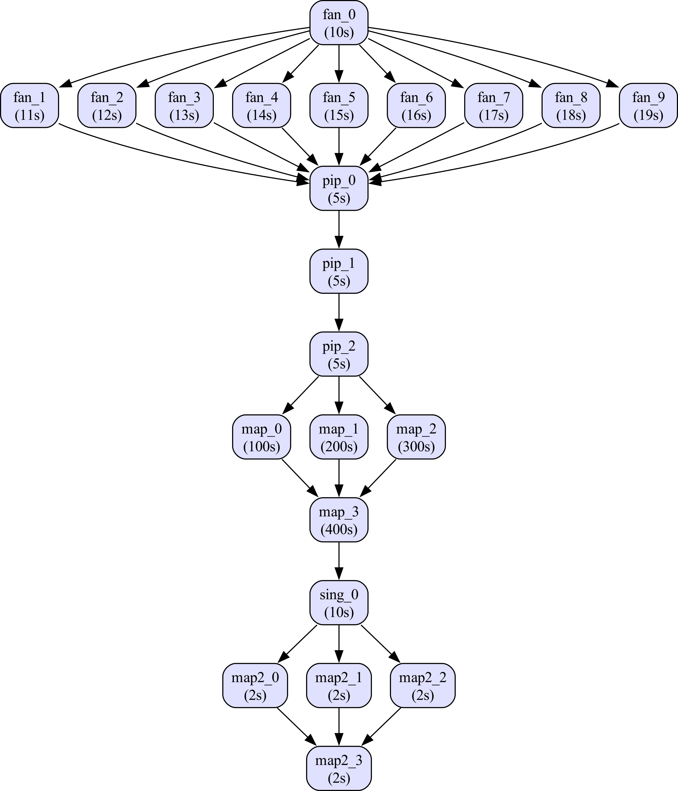

# Parsl Workflow Builder using Patterns

This is a Python library designed for building and composing scientific workflows for Parsl based on reusable execution patterns.  
It models workflows as graphs of interdependent patterns (e.g., *MapReduce*, *Fan*, *SingleTask*, *Pipeline*) and their connections,  
allowing the automatic generation of a fully expanded task-level workflow and its corresponding Python representation.

---

## Features

- Represents workflows as compositions of reusable execution patterns.  
- Manages dependencies among patterns in a high-level graph structure.  
- Generates the full composed task-level DAG.  
- Produces standalone Python code for workflow execution.  
  *(Note: the generated code must be complemented with proper imports and indentation.)*  
- Exports the generated DAG using Pydot.

---

## Core Structure

The project’s core is based on two primary abstractions: **Pattern** and **Workflow**.

### `Pattern`
Base class representing an execution pattern.  
Each pattern defines its internal structure as a `networkx.DiGraph`, where nodes represent computational tasks.

Main methods:
- `get_inputs()`: returns input nodes (with no predecessors).  
- `get_outputs()`: returns output nodes (with no successors).  

---

### Implemented Patterns

- **`SingleTask`** — represents a single execution node.  
- **`MapReduce`** — multiple parallel map tasks followed by a reduction stage.  
- **`Fan`** — branching structure (one node triggering multiple tasks).  
- **`Pipeline`** — represents multiple sequential tasks.

Each pattern constructs its own internal DAG (`dag`) and defines the number of tasks, their connections, and the execution time of each task.  
New patterns can be easily added by extending the `Pattern` base class.

---

### `Workflow`
Represents a composition of multiple patterns and the dependencies between them.  
It is responsible for combining the individual pattern DAGs into a single composed workflow.

Main functionalities:
- `add_pattern(pattern)`: adds a new pattern to the workflow.  
- `add_pattern_edge(p1, p2)`: defines a dependency between two patterns.  
- `set_new_root(p_id)`: sets the root pattern of the workflow.  
- `remove_pattern_node(p_id)`: removes a pattern from the workflow.  
- `remove_pattern_edge(p1, p2)`: removes a dependency.  
- `parse()`: merges all subgraphs, generates the composed DAG, and produces the equivalent Python code.  
- `export_pydot()`: exports the workflow graph as a Pydot string and optionally saves it as a PDF file.

---

## Example Usage

```python
from workflowbuilder import *

# Create a workflow
wf = Workflow()

# Add patterns
wf.add_pattern(Fan("fan", 10, [i for i in range(10, 20)]))
wf.add_pattern(Pipeline("pip", 3, 5))
wf.add_pattern(MapReduce("map", 4, [100, 200, 300, 400]))
wf.add_pattern(SingleTask("sing", 10))
wf.add_pattern(MapReduce("map2", 4, 2))

# Define dependencies
wf.add_pattern_edge("fan", "pip")
wf.add_pattern_edge("pip", "map")
wf.add_pattern_edge("map", "sing")
wf.add_pattern_edge("sing", "map2")

# Set root pattern (by default, the root is the first added pattern)
# The root is used to perform the parsing.
wf.set_new_root("fan")

# Generate Python code representing the workflow, split into definitions and calls
tasks_definitions, tasks_calls = wf.parse()

# Export the DAG
wf.export_pydot()

```

Workflow produced by the code above.

